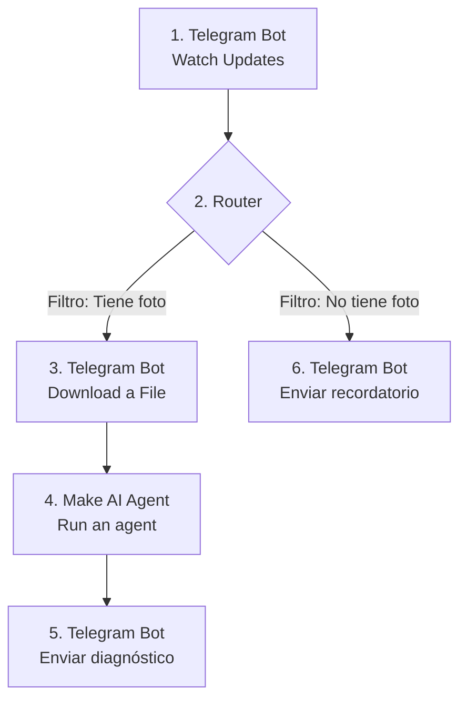

# 🌿 Chatbot Biodiversidad – PlantaBot

Bot inteligente de **Telegram** que recibe fotos de plantas, las analiza con **inteligencia artificial** y responde con un diagnóstico amigable sobre su **salud, riego y cuidados**. Está construido sin código en **Make** con un **Make AI Agent**.

| | |
|---|---|
| **Alumno** | José Reyes Valdés Zamudio |
| **Materia** | Desarrollo Sustentable |
| **Carrera** | Ingeniería en Inteligencia Artificial |
| **Plataforma** | Make + Telegram Bot API + Make AI Agents |

---

## 📌 Descripción del proyecto

Mucha gente tiene plantas en casa pero no sabe identificarlas ni cuidarlas, y por eso se secan o se enferman. **PlantaBot** pone a un "botánico de bolsillo" en Telegram. El usuario manda una foto de su planta y en segundos recibe:

- 🌿 El **nombre** de la planta (común y científico)
- 💚 Un diagnóstico de su **salud** (hojas, color, plagas, manchas)
- 💧 Recomendaciones de **riego**
- ☀️ Consejos de **luz y cuidados**
- ⚠️ Los **problemas detectados** y cómo solucionarlos

Si el usuario escribe sin mandar foto, el bot le recuerda amablemente que necesita una imagen.

### 🌎 Relación con el Desarrollo Sustentable

- **Conservación de la biodiversidad:** acerca a las personas al conocimiento de las especies vegetales.
- **Uso responsable del agua:** recomienda riegos adecuados y evita el desperdicio por exceso de riego.
- **Menos agroquímicos:** detecta problemas a tiempo y sugiere soluciones antes de recurrir a pesticidas.
- **Educación ambiental:** fomenta el cuidado de las plantas y de las áreas verdes urbanas.
- Se relaciona con los **ODS 4** (Educación de calidad), **6** (Agua limpia), **11** (Ciudades sostenibles) y **15** (Vida de ecosistemas terrestres).

---

## 🏗️ Arquitectura del escenario

---

## Código 
[Chatbot Biodiversidad.blueprint.json](https://github.com/user-attachments/files/33134294/Chatbot.Biodiversidad.blueprint.json)

> Para importarlo: en Make, abre un escenario nuevo → menú **⋮** → **Import Blueprint** → selecciona el archivo.

## 🖼️ Imágenes

## 🎥 Video

Demostración del bot funcionando: envío de foto, diagnóstico de la IA y recordatorio cuando no se envía imagen.

▶️ **[Ver video en YouTube / Google Drive](PEGA_AQUI_EL_LINK_DEL_VIDEO)**

---

## 📊 Resultados

| Prueba | Entrada | Resultado esperado | Resultado obtenido |
|---|---|---|---|
| 1 | Foto de planta sana | Identificación y cuidados | ✅ Correcto |
| 2 | Foto de planta con hojas secas o manchas | Diagnóstico del problema y solución | ✅ Correcto |
| 3 | Foto con comentario ("se le caen las hojas") | Respuesta que toma en cuenta el comentario | ✅ Correcto |
| 4 | Mensaje de texto sin foto ("Hola") | Recordatorio amable pidiendo imagen | ✅ Correcto |
| 5 | Comando `/start` | Mensaje de bienvenida / recordatorio | ✅ Correcto |
| 6 | Foto que no es planta | Aviso amable y petición de otra foto | ✅ Correcto |

